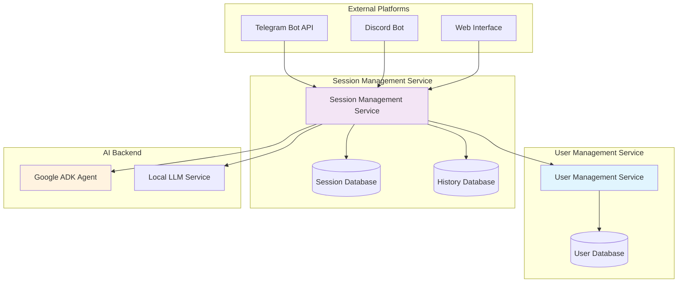
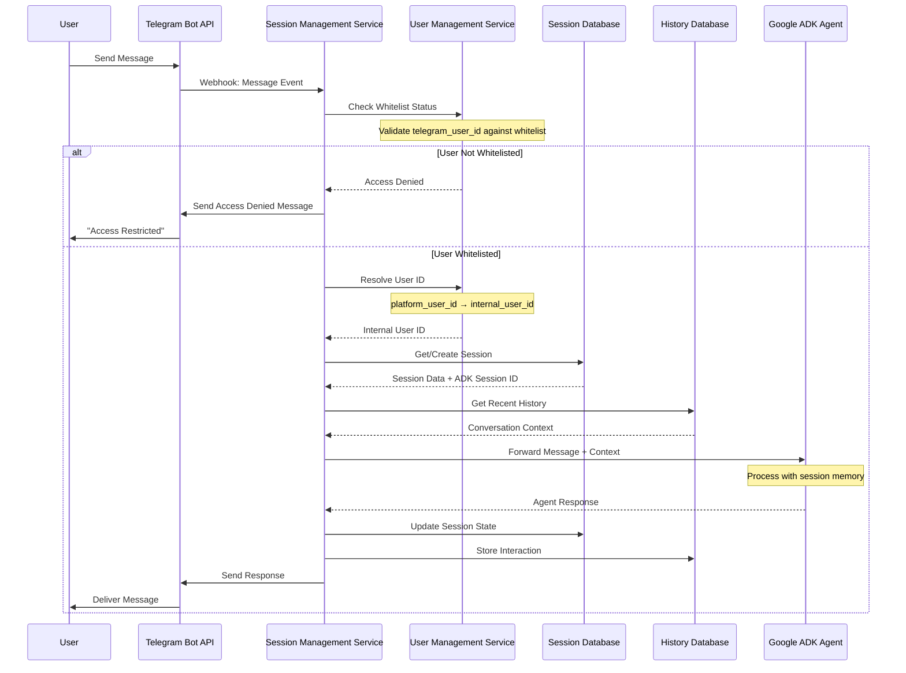
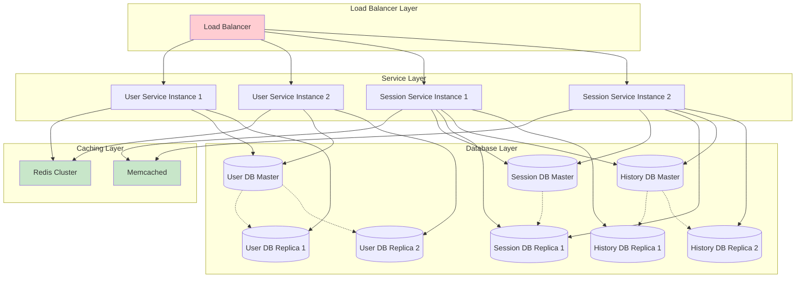

# ADR-03: User and Session Management Architecture

## Status
Proposed

## Date
2025-10-04

## Context

The Assistant Octopus system requires a robust architecture for managing user identities and conversation sessions across multiple platforms, specifically Telegram Bot API integration with Google Agent Development Kit (ADK). The system must maintain conversation context, user state, and session continuity while supporting scalable, modular design principles.

### Key Requirements
- Integrate Telegram Bot API with Google ADK agents
- Maintain conversation context across multiple interactions
- Support user identification across different platforms
- Enable session persistence and recovery
- Provide scalable architecture for concurrent users
- Abstract database implementation for flexibility
- Implement telegram user whitelist for access control

## Decision

We will implement a modular, service-oriented architecture with clear separation of concerns between user management and session management. The architecture will consist of two primary services with corresponding data stores.

### Architecture Components



#### 1. User Management Service
**Responsibility**: User identity management and platform binding

**Abstract Data Structure**:
```
UserEntity {
  internal_user_id: UUID (Primary Key)
  platform_bindings: Map<Platform, PlatformUserId>
  user_metadata: Map<String, Any>
  created_at: Timestamp
  updated_at: Timestamp
  status: UserStatus (active, suspended, deleted)
  access_level: AccessLevel (whitelisted, admin, restricted)
}

WhitelistEntity {
  whitelist_id: UUID (Primary Key)
  platform: Platform
  platform_user_id: String
  access_level: AccessLevel
  whitelisted_by: UUID (Foreign Key to UserEntity)
  whitelisted_at: Timestamp
  expires_at: Timestamp?
  status: WhitelistStatus (active, revoked, expired)
}

Platform Bindings Example:
{
  "telegram": "123456789",
  "discord": "987654321",
  "web": "user@example.com"
}
```

#### 2. Session Management Service
**Responsibility**: Conversation context, ADK session coordination, and interaction history

**Abstract Data Structures**:
```
SessionEntity {
  session_id: UUID (Primary Key)
  internal_user_id: UUID (Foreign Key)
  adk_session_id: String
  platform: Platform
  session_state: SessionState (active, paused, terminated)
  context_metadata: Map<String, Any>
  created_at: Timestamp
  last_activity_at: Timestamp
  expires_at: Timestamp?
}

ConversationHistoryEntity {
  interaction_id: UUID (Primary Key)
  session_id: UUID (Foreign Key)
  sequence_number: Integer
  message_type: MessageType (user_input, agent_response, system)
  content: Text
  metadata: Map<String, Any>
  timestamp: Timestamp
}

    # Extended fields for conversation summarization and tagging
    summary: Text  # Optional summary of the conversation or message
    tags: List<String>  # Optional list of tags for categorization

SessionStateEntity {
  session_id: UUID (Primary Key, Foreign Key)
  state_data: JSON
  checkpoint_version: Integer
  created_at: Timestamp
}
```

### Message Flow Architecture



**Detailed Flow Steps**:
1. **Message Ingestion**: Telegram webhook receives user message
2. **Access Control**: Validate telegram user ID against whitelist
3. **User Resolution**: Extract platform user ID → resolve to internal user ID (if whitelisted)
4. **Session Retrieval**: Locate or create active session for user
5. **Context Assembly**: Gather conversation history and session state
6. **ADK Integration**: Forward message with session context to ADK agent
7. **Response Processing**: Receive agent response and update session state
8. **History Persistence**: Store interaction in conversation history
9. **Response Delivery**: Send response back through appropriate platform

```

### Database Entity Relationships

```mermaid
erDiagram
    UserEntity {
        UUID internal_user_id PK
        Map platform_bindings
        Map user_metadata
        Timestamp created_at
        Timestamp updated_at
        UserStatus status
        AccessLevel access_level
    }
    
    WhitelistEntity {
        UUID whitelist_id PK
        Platform platform
        String platform_user_id
        AccessLevel access_level
        UUID whitelisted_by FK
        Timestamp whitelisted_at
        Timestamp expires_at
        WhitelistStatus status
    }
    
    SessionEntity {
        UUID session_id PK
        UUID internal_user_id FK
        String adk_session_id
        Platform platform
        SessionState session_state
        Map context_metadata
        Timestamp created_at
        Timestamp last_activity_at
        Timestamp expires_at
    }
    
    ConversationHistoryEntity {
        UUID interaction_id PK
        UUID session_id FK
        Integer sequence_number
        MessageType message_type
        Text content
        Map metadata
        Timestamp timestamp
    }
    
    SessionStateEntity {
        UUID session_id PK_FK
        JSON state_data
        Integer checkpoint_version
        Timestamp created_at
    }
    
    UserEntity ||--o{ SessionEntity : "has sessions"
    UserEntity ||--o{ WhitelistEntity : "whitelists others"
    WhitelistEntity ||--o| UserEntity : "grants access to"
    SessionEntity ||--o{ ConversationHistoryEntity : "contains interactions"
    SessionEntity ||--|| SessionStateEntity : "maintains state"
```

### ADK Integration Points

- **Session Management**: Map internal session IDs to ADK session IDs for context continuity
- **Memory Coordination**: Synchronize ADK memory with persistent session state
- **State Persistence**: Store ADK state transitions in session state entity
- **Context Recovery**: Restore ADK session context from persistent storage

## Rationale

### Benefits
1. **Platform Agnostic**: User service abstracts platform-specific identifiers
2. **Scalable**: Services can be independently scaled based on load
3. **Database Flexible**: Abstract structures work with SQL, NoSQL, or hybrid approaches
4. **Session Recovery**: Persistent state enables recovery from system failures
5. **Context Continuity**: ADK integration maintains conversation flow
6. **Audit Trail**: Complete interaction history for debugging and analysis

### Trade-offs
- **Complexity**: Additional service layer increases system complexity
- **Latency**: Service-to-service communication adds minimal latency
- **Storage**: Conversation history requires significant storage planning
- **Consistency**: Distributed state requires careful consistency management

## Implementation Considerations

### Database Abstraction
The abstract structures can be implemented using:
- **Relational**: PostgreSQL, MySQL with proper indexing on user_id and session_id
- **Document**: MongoDB, CouchDB storing entities as documents
- **Graph**: Neo4j for complex user relationship modeling
- **Hybrid**: Different stores for different entities based on access patterns

### Caching Strategy
- **User Lookups**: Cache platform-to-internal ID mappings
- **Active Sessions**: Cache frequently accessed session metadata
- **Recent History**: Cache last N interactions per session for quick context assembly

### Scaling Patterns
- **Horizontal Partitioning**: Shard by user_id hash for user service  
- **Session Affinity**: Route user sessions to consistent service instances
- **Read Replicas**: Separate read/write paths for conversation history



### Security Considerations
- **Data Encryption**: Encrypt conversation content at rest
- **Access Control**: Implement service-level authentication
- **User Whitelist**: Restrict access to approved Telegram accounts only
- **Access Levels**: Support different permission levels (admin, whitelisted, restricted)
- **Whitelist Management**: Allow admin users to manage whitelist entries
- **Audit Logging**: Track all user and session operations, including access attempts
- **Data Retention**: Implement configurable history retention policies
- **Rate Limiting**: Prevent abuse from whitelisted users

#### Whitelist Implementation Details
- **Bootstrap Admin**: Initial admin user configured via environment variables
- **Whitelist Validation**: All incoming messages validated against whitelist before processing
- **Expiring Access**: Support temporary access with configurable expiration
- **Access Revocation**: Immediate revocation of user access when needed
- **Failed Access Logging**: Log and monitor failed access attempts for security analysis

## Consequences

### Positive
- Clear separation of concerns enables independent service evolution
- Platform-agnostic design supports future integrations
- Persistent session state enables robust error recovery
- Comprehensive history supports analytics and debugging
- ADK integration provides advanced conversation capabilities

### Negative
- Increased operational complexity with multiple services
- Additional network hops may impact response latency
- Storage requirements grow with conversation volume
- Service coordination requires careful error handling
- Migration complexity for existing user data

### Neutral
- Database choice flexibility requires careful performance evaluation
- Service boundaries may need adjustment based on usage patterns
- Monitoring and observability requirements increase with service count

## Implementation Roadmap

This section outlines the step-by-step implementation plan to realize the architecture described above. Each step builds upon the previous ones and can be developed and tested independently.

### Phase 1: Foundation and Data Models

#### Step 1: Create Core Data Models
- [x] **1.1** Create `UserEntity` model with all fields (internal_user_id, platform_bindings, user_metadata, access_level, etc.)
- [x] **1.2** Create `WhitelistEntity` model with access control fields
- [x] **1.3** Create `SessionEntity` model for session management
- [x] **1.4** Create `ConversationHistoryEntity` model for interaction storage
- [x] **1.5** Create `SessionStateEntity` model for ADK state persistence
- [x] **1.6** Define enums: `UserStatus`, `AccessLevel`, `WhitelistStatus`, `SessionState`, `MessageType`, `Platform`
- [x] **1.7** Create Pydantic models for API serialization/validation

**Deliverable**: Complete data model definitions with proper typing and validation

#### Step 2: Storage Abstraction Layer
- [x] **2.1** Design abstract `StorageBackend` interface
- [x] **2.2** Implement Supabase/PostgreSQL storage backend for production
- [x] **2.3** Create storage factory pattern for backend selection
- [x] **2.4** Add proper error handling and connection management

**Deliverable**: Pluggable storage system supporting both file and database backends

#### Step 3: Repository Pattern Implementation
- [x] **3.1** Create `UserRepository` with CRUD operations
- [x] **3.2** Create `WhitelistRepository` with access control queries  
- [x] **3.3** Create `SessionRepository` with session lifecycle management
- [x] **3.4** Create `ConversationHistoryRepository` with efficient querying
- [x] **3.5** Create `SessionStateRepository` for ADK state management
- [x] **3.6** Add repository integration tests with mocked storage

**Deliverable**: Complete data access layer with comprehensive test coverage

### Phase 2: Core Services

#### Step 4: User Management Service
- [x] **4.1** Implement `UserService` class with service registry integration
- [x] **4.2** Add user creation and profile management methods
- [x] **4.3** Implement platform binding management (add/remove/update)
- [x] **4.4** Add user lookup by platform ID functionality
- [x] **4.5** Implement user status management (active/suspended/deleted)
- [x] **4.6** Add comprehensive logging and error handling
- [x] **4.7** Create unit tests with mocked dependencies

**Deliverable**: Complete user management service integrated with existing service registry

#### Step 5: Whitelist Management Service
- [ ] **5.1** Implement `WhitelistService` as part of User Management Service
- [ ] **5.2** Add whitelist validation methods for incoming requests
- [ ] **5.3** Implement admin functions (add/remove/update whitelist entries)
- [ ] **5.4** Add expiration handling for temporary access
- [ ] **5.5** Implement access level verification
- [ ] **5.6** Add bootstrap admin functionality via environment variables
- [ ] **5.7** Create access denied response handling
- [ ] **5.8** Add audit logging for all whitelist operations

**Deliverable**: Robust access control system with admin management capabilities

#### Step 6: Session Management Service
- [ ] **6.1** Implement `SessionService` class
- [ ] **6.2** Add session creation and lifecycle management
- [ ] **6.3** Implement ADK session ID mapping and coordination
- [ ] **6.4** Add conversation history management
- [ ] **6.5** Implement session state persistence and recovery
- [ ] **6.6** Add session cleanup and expiration handling
- [ ] **6.7** Create context assembly for ADK integration
- [ ] **6.8** Add comprehensive session testing

**Deliverable**: Complete session management with ADK integration support

### Phase 3: Platform Integration

#### Step 7: Enhanced Telegram Client Integration
- [ ] **7.1** Modify existing `tg_client.py` to integrate with new services
- [ ] **7.2** Add whitelist validation to message handlers
- [ ] **7.3** Implement user resolution and session retrieval
- [ ] **7.4** Add access denied message responses
- [ ] **7.5** Integrate conversation history logging
- [ ] **7.6** Add proper error handling for service failures
- [ ] **7.7** Update webhook handlers with new flow

**Deliverable**: Updated Telegram integration with full user and session management

#### Step 8: ADK Integration Enhancement
- [ ] **8.1** Create ADK client wrapper for session management
- [ ] **8.2** Implement session context forwarding to ADK
- [ ] **8.3** Add ADK response processing and state synchronization
- [ ] **8.4** Implement session recovery mechanisms
- [ ] **8.5** Add ADK error handling and fallback strategies
- [ ] **8.6** Create ADK session cleanup procedures

**Deliverable**: Seamless ADK integration with persistent session management

### Phase 4: API and Administration

#### Step 9: REST API Endpoints
- [ ] **9.1** Create user management API endpoints (`/api/users/`)
- [ ] **9.2** Add whitelist management API endpoints (`/api/whitelist/`)
- [ ] **9.3** Implement session management API endpoints (`/api/sessions/`)
- [ ] **9.4** Add conversation history API endpoints (`/api/conversations/`)
- [ ] **9.5** Create admin-only endpoints with proper authorization
- [ ] **9.6** Add API documentation with OpenAPI/Swagger
- [ ] **9.7** Implement rate limiting and request validation

**Deliverable**: Complete REST API for system administration and monitoring

#### Step 10: CLI Administration Tools
- [ ] **10.1** Extend existing `cli_server.py` with user management commands
- [ ] **10.2** Add whitelist management CLI commands
- [ ] **10.3** Implement session monitoring and cleanup commands
- [ ] **10.4** Add bootstrap admin setup command
- [ ] **10.5** Create data export/import utilities
- [ ] **10.6** Add system health check commands

**Deliverable**: Comprehensive CLI tools for system administration

### Phase 5: Production Readiness

#### Step 11: Caching and Performance
- [ ] **11.1** Implement Redis caching for user lookups
- [ ] **11.2** Add session metadata caching
- [ ] **11.3** Cache recent conversation history
- [ ] **11.4** Implement cache invalidation strategies
- [ ] **11.5** Add performance monitoring and metrics
- [ ] **11.6** Optimize database queries and indexing

**Deliverable**: High-performance system with proper caching strategies

#### Step 12: Security and Monitoring
- [ ] **12.1** Implement data encryption at rest
- [ ] **12.2** Add comprehensive audit logging
- [ ] **12.3** Implement rate limiting and abuse prevention  
- [ ] **12.4** Add security monitoring and alerting
- [ ] **12.5** Create data retention and cleanup policies
- [ ] **12.6** Add backup and disaster recovery procedures

**Deliverable**: Production-ready system with enterprise security features

#### Step 13: Testing and Documentation
- [ ] **13.1** Create comprehensive integration tests
- [ ] **13.2** Add end-to-end testing scenarios
- [ ] **13.3** Implement load testing for scalability validation
- [ ] **13.4** Create deployment documentation
- [ ] **13.5** Add operational runbooks
- [ ] **13.6** Create user and admin documentation

**Deliverable**: Fully tested and documented system ready for production deployment

### Development Guidelines

#### Code Organization
- Place data models in `models/` directory
- Implement services in `services/user/` and `services/session/` directories
- Add repositories in `db/repositories/` directory
- Update API routes in `api/routes/` directory

#### Testing Strategy
- Unit tests for each service with mocked dependencies
- Integration tests for service interactions
- End-to-end tests for complete user flows
- Performance tests for scalability validation

#### Configuration Management
- Use environment variables for all configurable parameters
- Support different configurations for development/testing/production
- Implement proper secret management for sensitive data

#### Deployment Considerations
- Ensure backward compatibility during gradual rollout
- Plan database migration strategies
- Consider feature flags for controlled feature rollout
- Implement proper monitoring and alerting from day one
